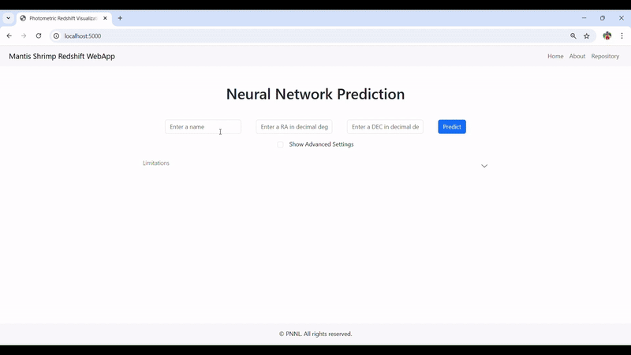

[](https://arxiv.org/abs/2501.09112)

# Mantis Shrimp Streamlit WebApp

<p align="center">
    
</p>

Mantis Shrimp is a computer vision model for photometric redshift estimation in the Northern sky (DEC > -30). This repository houses the model weights, a pip installable package to enable integration with existing projects, a Docker build script to run a local webapp server, jupyter notebooks demonstrating the training of Mantis Shrimp for reproducibility, tutorials in deep learning for astronomy (coming soon), and associated artifacts.

## Streamlit WebApp Demonstration

<p align="center">
    
</p>

This Streamlit application provides an interactive web interface for the Mantis Shrimp photometric redshift estimation model. The webapp allows users to input sky coordinates and receive photometric redshift estimates with visualizations.

## Installation and Setup

### Prerequisites

- Python 3.7+
- Conda or Mamba package manager
- Git LFS for model weights

### Installation Steps

1. **Clone the repository:**

```bash
git clone https://github.com/ericjiangpnnl/mantisshrimp-streamlit.git
```

2. **Install additional dependencies:**

```bash
pip install -r requirements.txt
```

## Running the Streamlit Application

### Option 1: Direct Command

```bash
streamlit run app/1_Home.py
```

The application will be available at http://localhost:8501 by default.

## Project Structure

```
MantisShrimp-Streamlit/
├── app/                      # Main application directory
│   ├── 1_Home.py            # Main Streamlit entry point
│   ├── config.py            # App configuration
│   ├── pages/               # Streamlit pages directory
│   │   ├── __init__.py
│   │   └── 2_About.py       # About page
│   └── utils/               # Utility functions
│       ├── __init__.py
│       ├── calpit_diagnostics.py
│       ├── download.py      # Download utilities
│       ├── downloads.py     # Download utilities
│       └── visualization.py # Visualization utilities
├── data/                    # Data directory
├── images/                  # Images and logos
├── mantis_shrimp/          # Core MantisShrimp package
├── NOTEBOOKS/              # Jupyter notebooks
├── slurm_scripts/          # SLURM job scripts
├── requirements.txt        # Python dependencies
└── README.md              # This file
```

## Features

### Home Page

- Interactive coordinate input form
- Real-time photometric redshift estimation
- Visualization of probability density functions
- Image cutout display from multiple surveys
- Download options for results and data

### About Page

- Detailed information about the Mantis Shrimp model
- Usage instructions and tutorials
- Technical specifications
- Model limitations and considerations

## API Usage

You can also query the Streamlit app programmatically once it's running:

```python
import requests

# URL of the running Streamlit app
url = 'http://localhost:8501'

# Example coordinates
data = {"RA": 197.6144, "DEC": 18.4381}

# Note: Streamlit apps don't have built-in API endpoints
# You would need to implement custom API endpoints if needed
```

## Limitations

This repository should be used with special context that the computer vision model was trained over a tailored dataset of spectroscopically confirmed galaxies with cutouts centered on those galaxies. Our pipeline will assign a photometric redshift to arbitrary coordinates of the sky. **However, that does not mean our model should be trusted everywhere--** galaxies that are not observed in the PanSTARRS/WISE footprint are simply not going to have accurate photometric redshifts with this tool. Additional care must be taken to ensure the target galaxy is centered on the image, which is why we advise using our tool in tandem with sky browsers, for example, available from [PanSTARRs](https://ps1images.stsci.edu/cgi-bin/ps1cutouts).

Additionally, its not likely our model extends well to galaxies outside the support of our spectroscopic training datasets, which are biased to large red elliptical galaxies. This is a problem shared for essentially all machine learning photometric redshift models unless we limit ourselves to flux-limited samples like the SDSS MGS, or soon the DESI BGS. Future work should endeavor to either mitigate this by utilizing simulated images to augment the training set or use anomaly detection to flag when cutouts are unlike anything in the training distribution. Both would be at the cutting edge of AI research.

## Data availability

You can download the Mantis Shrimp Dataset from [PNNL's Datahub](https://data.pnnl.gov/group/nodes/dataset/33966). DataHub is a free to use data repository for PNNL; its backend is Globus.

## External Dependencies & Considerations

In addition to the software dependencies, this software relies upon the availability of data from NASA STSci and NSF AstroDataLab servers.

We have packaged this webapp with dustmaps provided by Yi-Kuan Chiang, author of the corrected SFD map, and the Planck map provided by the European Space Agency. The exact sources of this data are:

```bash
#STSci and ADL:
https://ps1images.stsci.edu/cgi-bin/fitscut.cgi
www.legacysurvey.org/viewer/fits-cutout?
#Dustmaps
https://zenodo.org/record/8207175/files/csfd_ebv.fits
https://zenodo.org/record/8207175/files/mask.fits
http://pla.esac.esa.int/pla/aio/product-action?MAP.MAP_ID=HFI_CompMap_ThermalDustModel_2048_R1.20.fits
```

## Citation

If you find our paper helpful or use the Mantis Shrimp model or webapp in your research, consider citing our paper:

```bash
@ARTICLE{mantisshrimpengel,
      title={Mantis Shrimp: Exploring Photometric Band Utilization in Computer Vision Networks for Photometric Redshift Estimation},
      author={Andrew Engel and Nell Byler and Adam Tsou and Gautham Narayan and Emmanuel Bonilla and Ian Smith},
      year={2025},
      eprint={2501.09112},
      archivePrefix={arXiv},
      primaryClass={astro-ph.IM},
      url={https://arxiv.org/abs/2501.09112},
}
```

## Authors

Andrew Engel (OSU and PNNL), Nell Byler (PNNL), Adam Tsou (JHU), Gautham Narayan (UIUC), Manny Bonilla (PNNL), and Ian Smith (PNNL) all contributed to this work.

## Funding Acknowledgement

A. Engel, N. Byler, A. Tsou, E. Bonilla, and Ian Smith were partially supported by an interagency agreement (IAA) between NASA and the DOE in liu of grant awarded through the NASA ROSES D.2 Astrophysics Data Analysis grant # 80NSSC23K0474, ``Multi-Survey Photometric Redshifts with Probabilistic Output for Galaxies with 0.0 < Z < 0.6.''

## Disclaimer

This material was prepared as an account of work sponsored by an agency of the
United States Government. Neither the United States Government nor the United
States Department of Energy, nor Battelle, nor any of their employees, nor any
jurisdiction or organization that has cooperated in the development of these
materials, makes any warranty, express or implied, or assumes any legal
liability or responsibility for the accuracy, completeness, or usefulness or
any information, apparatus, product, software, or process disclosed, or
represents that its use would not infringe privately owned rights.

Reference herein to any specific commercial product, process, or service by
trade name, trademark, manufacturer, or otherwise does not necessarily
constitute or imply its endorsement, recommendation, or favoring by the United
States Government or any agency thereof, or Battelle Memorial Institute. The
views and opinions of authors expressed herein do not necessarily state or
reflect those of the United States Government or any agency thereof.

                 PACIFIC NORTHWEST NATIONAL LABORATORY
                              operated by
                                BATTELLE
                                for the
                   UNITED STATES DEPARTMENT OF ENERGY
                    under Contract DE-AC05-76RL01830
